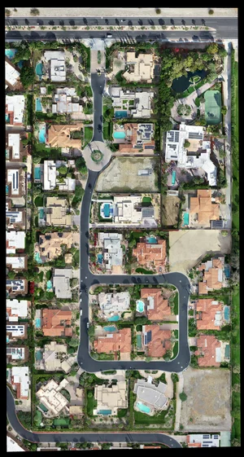
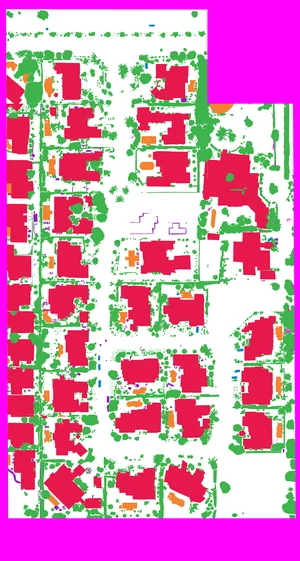

# Heimdall

<p align=center>
  
  <br>
  <span>A PyTorch pipeline for <em>semantic segmentation</em> on orthographic drone imagery.</span>
  <br>
  <a target="_blank" href="https://www.python.org/downloads/" title="Python version"></a>
  <a target="_blank" href="LICENSE" title="License: MIT"></a>
</p>

<p align="center">
  <a href="#setup">Setup</a>
  &nbsp;&nbsp;&nbsp;|&nbsp;&nbsp;&nbsp;
  <a href="#configuration">Configuration</a>
  &nbsp;&nbsp;&nbsp;|&nbsp;&nbsp;&nbsp;
  <a href="#data">Data</a>
  &nbsp;&nbsp;&nbsp;|&nbsp;&nbsp;&nbsp;
  <a href="#model">Model</a>
  &nbsp;&nbsp;&nbsp;|&nbsp;&nbsp;&nbsp;
  <a href="#notes">Notes</a>
  &nbsp;&nbsp;&nbsp;|&nbsp;&nbsp;&nbsp;
  <a href="#citation">Citation</a>
  </p>

## Setup

Clone this repository.

```bash
git clone https://github.com/kelvindecosta/heimdall.git && cd heimdall
```

Install dependencies.

```bash
pip install -r requirements.txt
```

## Configuration

All configuration settings for the dataset and model are specified in `config.yml`.
When the pipeline is executed for the first time, this file is generated based on the template specified in [`templates/conf.yml`](`templates/conf.yml`).

Familiarize yourself with the configuration settings to better understand the pipeline.

## Data

The [DroneDeploy Segmentation Dataset](https://www.dronedeploy.com/blog/dronedeploy-segmentation-benchmark-challenge/) contains orthographic drone imagery of urban areas.

Each image has a corresponding label.
In the labels each pixel has one of 7 colors (RGB) corresponding to the different classes.

> Note that unlabelled pixels are magenta in color in the label.

|                Image                |                Label                |
| :---------------------------------: | :---------------------------------: |
|  |  |

In the configuration, `dataset.classes` is a list of dictionaries each with:

- `name` indicating the name of the class
- `color`, a 3-item list denoting the RGB value of the pixels labelled for that class

### Download

Two datasets are available for download, one much smaller than the other.
In the configuration:

- `dataset.choice` selects one particular dataset.
- `dataset.urls` is a dictionary of download links for the datasets

Run the following command to download the dataset:

```bash
python main.py download
```

An archive begins to download into the `downloads/` directory.
Once the download is complete, the dataset is extracted into the `data/` directory.

> Note that the provided links point to slightly modified versions of the original datasets.
> The differences are:
>
> - the absence of the elevation images
> - the replacement of `index.csv` with `index.json`, which specifies the sample set splitting ("train", "valid" and "test")

### Tiling

Each image, along with its corresponding label, must be broken into smaller square tiles.
This is done because:

- smaller input sizes speeds up the training process of the model.
- unlabelled pixels can be easily ignored (by ignoring the entire tile, rather than the entire image).

In the configuration, `dataset.size` denotes the size of the generated square tiles in pixels.

Run the following command to generate tiles from the dataset.

```bash
python main.py tile
```

Tiles are saved in the `tiles/` subdirectory of the downloaded dataset.

|                  Image Tile                   |                  Label Tile                   |
| :-------------------------------------------: | :-------------------------------------------: |
|  |  |

> Note that:
>
> - depending on the size of the image and tile size, border pixels might get lost during tiling.
> - tiles that would contain at least one unlabelled pixel are not generated.

### Transformations

#### Augmentations

Images and labels are augmented based on the `dataset.transformations.augmentation` configuration.

> Note that these augmentations are performed using the [`albumentations` Python package](https://albumentations.readthedocs.io/en/latest/index.html).

#### Preprocessing

Images are transformed before feeding directly into the model based on the `dataset.transformations.preprocessing` configuration.

> Note that these transformations are performed using the [`torchvision.transforms` module](https://pytorch.org/docs/stable/torchvision/transforms.html)

## Model

The `model` configuration specifies the:

- `architecture` of the neural network.
- `metric` for accuracy.
- `criterion` i.e., the loss function.
- `optimizer` which handles gradient descent and backpropagation.
- `scheduler` which changes the learning rate across epochs.
- `batch-sizes` for different phases
- `epochs` i.e., the number of iterations on the entire dataset.

> Note that the model definitions in the [`segmentation-models-pytorch` package](https://github.com/qubvel/segmentation_models.pytorch) are used in this pipeline.

### Train

Run the following command to train a model:

```bash
python main.py train
```

Run information is stored in the `runs/` directory.
Each run is uniquely identified by the time at the start of its execution.
The configuration file is copied for reference.

Models are saved in the corresponding run directory, after the first epoch.
If a model performs better on the validation set than it did in the previous epoch, it is overwritten.

The pipeline also provides support for [`tensorboard`](https://www.tensorflow.org/tensorboard) logging:

```bash
tensorboard --logdir=runs
```

### Predict

Use the following command template to perform predictions:

```bash
python main.py predict <input_path> <model_path> <output_path>
```

## Notes

The pipeline can be improved by:

- using loss functions that account for class weights.
- allowing a model to resume training after interruption.

## Citation

If you use this pipeline in your work, please cite the following:

```bibtex
@misc{decosta2020heimdall,
    author = {Kelvin DeCosta},
    title = {Heimdall},
    year = {20202},
    howpublished = {\url{https://github.com/kelvindecosta/heimdall}},
}
```
